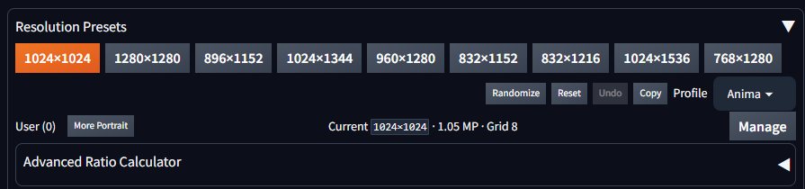

# Forge Neo Resolution Presets


[日本語版 / Japanese](README_ja.md)

Documentation is available in English and Japanese. The extension UI uses compact English labels and Forge Neo's existing UI language/theme.

Compact resolution presets for Forge Neo txt2img and img2img.

## Features

- Model-family profiles with one-click Width/Height presets.
- The `SDXL` profile covers SDXL/Illustrious-style workflows and includes additional portrait presets.
- Shared user presets saved from the current Width/Height values.
- Optional per-generation randomization from the current Profile's built-in presets.
- Compact `More Portrait`, `Reset`, `Undo`, and `Copy` actions.
- Optional aspect-ratio calculator that preserves the current total pixel area.
- Works independently in txt2img and img2img without recreating Forge Neo's native Width/Height controls.
- No image processing, upscaling, checkpoint inspection, or generation-side processing.

## Install

Copy this folder into:

```text
Forge-Neo/extensions/Forge-Neo-Resolution-Presets
```

Restart Forge Neo or use the Extensions restart action.

## Settings tab


Open `Settings` → `Extensions` → `Resolution Presets` to edit Profiles and manage extension data. The Settings page does not replace Forge Neo's native Width/Height controls; changes are applied to txt2img/img2img after the saved Profile is reloaded.

### Profile Editor

`profiles.json` contains the read-only built-in Profiles. The editor keeps changes as a browser-side Draft until `Save changes` is clicked.

- `New profile` opens a name editor. `Duplicate profile` copies the selected Profile, while `Delete profile` removes it after confirmation. The last Profile cannot be deleted.
- Edit `Width`/`Height` directly. Values must be integers between 16 and 16384, multiples of 8, and unique within a Profile.
- Drag the ↕ handle to reorder rows. `Alt`+`↑`/`↓` also moves the focused row. The first 9 presets are `Main`; later entries are `More Portrait`.
- Row `Duplicate`/`Delete` affects a Preset only. Use the Profile toolbar for Profile-level operations.
- `Save changes` validates the Draft, creates an automatic backup, and writes `data/profile_overrides.json`. Use `Reload UI` afterward to apply the saved Profile to txt2img/img2img.
- `Restore built-in profiles` warns before discarding the Draft. An unsaved Draft is also protected by a warning when the UI or page is reloaded.

### Backup / Restore

`Create backup` saves the current Profile configuration in `data/profile_backups/`. Select a backup and click `Restore selected` to restore it; the restored Profile still requires `Reload UI` before it appears in the main tabs.

### Randomize settings

- `Start Randomize ON` controls whether the main-tab `Randomize` mode starts enabled after a UI reload.
- `Include custom presets` allows User presets to participate in per-generation randomization. It is off by default.
- Click `Save Randomize settings`, then reload the UI to apply the initial-state setting.

### Resolution History

The history panel records recent resolution changes with the resolution, Profile, tab, and timestamp. `Clear history` removes the local history file (`data/resolution_history.json`).

User presets are stored at runtime in `data/user_presets.json`. Existing files are backed up in `data/backups/` before each save or delete operation.

## File locations

Paths are relative to the extension root (`Forge-Neo-Resolution-Presets/`):

- Built-in model profiles and presets: `profiles.json`
- User presets: `data/user_presets.json`

- Last selected Profile per tab: `data/last_profiles.json`
- Export file: `data/user_presets-export.json`
- User-preset backups: `data/backups/`
- Edited profile override: `data/profile_overrides.json`
- Profile backups: `data/profile_backups/`
- Randomize settings: `data/behavior_settings.json`
- Resolution history: `data/resolution_history.json`

## UI behavior

- Clicking a built-in or user preset updates only the active tab's native Width and Height controls.
- A preset matching the current Width/Height is highlighted.
- A portrait preset is highlighted orange on exact match and blue with an outline when the current Width/Height is its landscape rotation; button labels and order stay fixed.
- Clicking the matching built-in preset toggles its orientation: orange switches to the blue landscape rotation, and blue switches back to the portrait value.
- Changing Profile changes the available built-in buttons but does not automatically change the current resolution.
- `More Portrait` reveals the extra portrait presets without increasing the default height.
- `Randomize` changes to a highlighted state; while enabled, one preset from the current Profile is selected for each generation. User presets are excluded by default; enable `Include custom presets` in the Settings tab to include them. Click `Randomize` again to disable it.
- `Reset` applies `1024x1024` (the first preset in the shipped Profiles). `Undo` restores the resolution before the last preset/reset action. `Copy` copies the current Width×Height text.
- Built-in presets contain square and portrait dimensions only. Use Forge Neo's native Width/Height swap control for landscape orientation.
- `1024x1536`, `960x1280`, `832x1152`, and `768x1280` are general portrait candidates based on mixed-aspect-ratio use; they are not guaranteed to be optimal for every checkpoint.
- The Advanced Ratio Calculator is collapsed by default.

## User presets

`Manage` toggles the management area open and closed.

1. Enter a name and click `Save current` to save the current native Width/Height.
2. Click a named button in the `User` row to load that preset into the active tab.
3. Open `Manage` and click `Delete` to remove a saved preset.
4. If the name already exists, click `Update` to overwrite that preset with the current Width/Height.
5. Click `Export` to create a JSON file. Choose a file with `Import JSON`, then click `Import` to replace the current user presets, or `Merge` to keep the current list and update matching names from the imported file. A backup is created before import.

User presets and the remembered Profile are local files only. They are not uploaded, synchronized with GitHub, or shared with another Forge Neo installation. Do not delete `data/user_presets.json` if you want to keep them. A timestamped backup is created in `data/backups/` before each save, update, delete, or import operation.

## Advanced Ratio Calculator

The calculator keeps the current total pixel area as the basis, calculates dimensions for the entered aspect ratio, and rounds them to the selected grid. It does not change Width/Height until `Apply` is clicked. It is an optional helper, not model analysis or upscaling. The `Quick` ratio buttons fill common aspect ratios into the calculator with one click.
