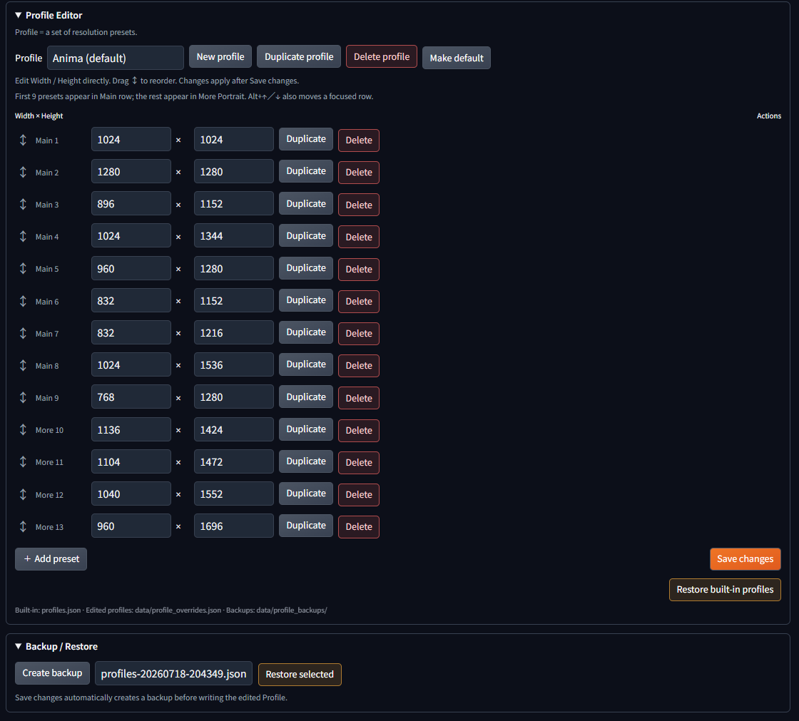

# Forge Neo Resolution Presets


[English version](README.md)

この拡張のドキュメントは英語と日本語に対応しています。UIはコンパクトな英語ラベルを使用し、Forge Neoの既存UIの言語・テーマに合わせて表示されます。

Forge Neoのtxt2img／img2img向け、コンパクトな解像度プリセット拡張です。

## 機能

- モデル系統別Profileの推奨解像度をワンクリック適用
- `SDXL` ProfileはSDXL／Illustrious系の用途を想定し、縦長プリセットを追加収録
- 現在のWidth／Heightをユーザープリセットとして保存
- 現在のProfileの固定プリセットから、生成ごとにランダム適用
- `More Portrait`、`Reset`、`Undo`、`Copy`をコンパクトに搭載
- 現在の総画素数を維持する任意アスペクト比計算
- txt2img／img2imgごとに、Forge Neo標準のWidth／Heightへ直接反映
- 画像処理、アップスケール、チェックポイント解析、生成処理は行わない

## 配置

このフォルダを次へ配置します。

```text
Forge-Neo/extensions/Forge-Neo-Resolution-Presets
```

配置後、Forge Neoを再起動してください。

## 設定タブ



`Settings` → `Extensions` → `Resolution Presets`を開くと、Profileの編集と拡張機能データの管理ができます。この設定ページはForge Neo標準のWidth／Height入力を置き換えません。保存したProfileを`Reload UI`で再読み込みすると、txt2img／img2imgへ反映されます。

### Profile Editor

`profiles.json`は標準Profileの読み取り専用データです。エディターの変更は`Save changes`を押すまでブラウザ上のDraftとして保持されます。

- `New profile`は名前を入力してProfileを作成します。`Duplicate profile`は選択中Profileを複製し、`Delete profile`は確認後に削除します。最後の1件は削除できません。
- `Width`／`Height`は直接編集できます。値は16～16384の整数、8の倍数で、同じProfile内で重複しない必要があります。
- ↕ハンドルをドラッグすると行の順番を変更できます。フォーカス中の行は`Alt`＋`↑`／`↓`でも移動できます。先頭9件が`Main`、10件目以降が`More Portrait`です。
- 行の`Duplicate`／`Delete`はPresetだけを対象にします。Profile全体を操作するときは上部のProfile操作ボタンを使います。
- `Save changes`はDraftを検証し、既存Profileを自動バックアップして`data/profile_overrides.json`へ保存します。保存後に`Reload UI`を押すとtxt2img／img2imgへ反映されます。
- `Restore built-in profiles`はDraftを破棄するため確認が表示されます。未保存Draftがある状態でUIまたはページを再読み込みした場合も、編集内容が失われる警告が表示されます。

### Backup / Restore

`Create backup`は現在のProfile設定を`data/profile_backups/`へ保存します。バックアップを選択して`Restore selected`を押すと復元できます。復元後も、メインタブへ反映するには`Reload UI`が必要です。

### Randomize設定

- `Start Randomize ON`は、UI再読み込み後にメインタブの`Randomize`を最初から有効にするかを設定します。
- `Include custom presets`を有効にすると、生成ごとのランダム選択にユーザープリセットも含められます。初期状態はオフです。
- `Save Randomize settings`を押してからUIを再読み込みすると、初期状態の設定が反映されます。

### Resolution History

履歴パネルには、最近の解像度変更を解像度、Profile、タブ、日時とともに表示します。`Clear history`でローカルの履歴ファイル（`data/resolution_history.json`）を削除できます。

ユーザープリセットは実行時に`data/user_presets.json`へ保存されます。保存・削除の前に、既存ファイルは`data/backups/`へバックアップされます。

## ファイルの保存場所

以下は拡張機能ルート（`Forge-Neo-Resolution-Presets/`）からの相対パスです。

- 既存のモデルProfile／固定プリセット：`profiles.json`
- ユーザープリセット：`data/user_presets.json`
- タブごとの最後のProfile：`data/last_profiles.json`
- エクスポート一時ファイル：`data/user_presets-export.json`
- ユーザープリセットのバックアップ：`data/backups/`
- Settingsで編集したProfile：`data/profile_overrides.json`
- Profileのバックアップ：`data/profile_backups/`
- Randomize設定：`data/behavior_settings.json`
- 解像度履歴：`data/resolution_history.json`

## 動作

- 固定プリセット／ユーザープリセットのクリックで、現在のタブのWidth／Heightだけを更新します。
- 現在のWidth／Heightと一致するプリセットは強調表示されます。
- 完全一致はオレンジ、縦横反転で一致する場合は青色＋青枠で表示します。ボタンの文字と順番は固定です。
- 現在一致している固定プリセットを押すと向きを切り替えます。オレンジは青色の横向きへ、青色はオレンジの縦向きへ戻ります。
- Profileを変更しても、現在の解像度は自動変更しません。
- `More Portrait`を押すと、通常表示の高さを増やさず追加の縦長プリセットを表示します。
- `Randomize`を押すと強調表示になり、有効中は現在のProfileから生成ごとに1件を選びます。初期状態ではユーザープリセットを除外し、設定タブの`Include custom presets`を有効にした場合だけ対象に含めます。もう一度押すと無効になります。
- `Reset`は標準Profileの先頭である`1024×1024`へ戻します。`Undo`は直前のプリセット／Reset前の解像度へ戻します。`Copy`は現在のWidth×Heightをクリップボードへコピーします。
- 固定プリセットは正方形・縦長のみです。横長へ切り替える場合は、Forge Neo標準のWidth／Height入れ替えボタンを使用します。
- `1024×1536`、`960×1280`、`832×1152`、`768×1280`は、混在アスペクト比で使いやすい汎用的な縦長候補です。すべてのチェックポイントで最適とは限りません。
- Advanced Ratio Calculatorは初期状態では折りたたまれています。

## ユーザープリセットの使い方

`Manage`を押すと管理欄が開き、もう一度押すと閉じます。

1. 名前を入力して`Save current`を押すと、現在のWidth／Heightを保存します。
2. `User`行に表示された名前のボタンを押すと、現在のタブへ読み込みます。
3. `Manage`を開き、対象行の`Delete`を押すと削除します。
4. 同名がある場合は`Update`を押すと、現在のWidth／Heightで上書きします。
5. `Export`でJSONを書き出し、`Import JSON`で選択して`Import`を押すとUserプリセットを置き換えます。`Merge`は現在の一覧を残し、同名だけインポート側で更新します。Import前にもバックアップを作成します。

ユーザープリセットと最後に選択したProfileはローカルファイルだけに保存されます。GitHubやクラウドへアップロードされず、別のForge Neo環境とも同期されません。プリセットを残したい場合は、このファイルや`data`フォルダを削除しないでください。保存・更新・削除・Importの前には、`data/backups/`へ日時付きバックアップを作成します。

## Advanced Ratio Calculatorの役割

現在のWidth×Heightの総画素数を基準に、入力したアスペクト比に合うWidth／Heightを計算します。`Round`は8／16／32／64単位の丸め幅です。`Apply`を押すまでWidth／Heightは変更しません。モデル解析やアップスケールを行う機能ではありません。

`Quick`の比率ボタンは、入力欄へ代表的な比率をワンクリックで設定します。
