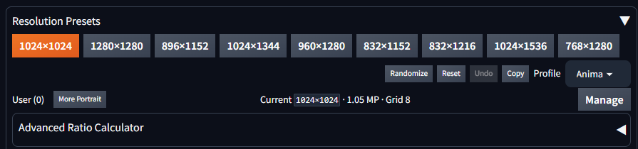
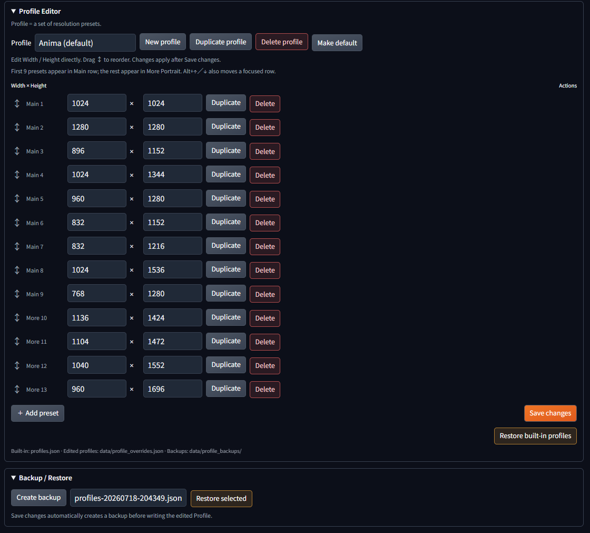

# Forge Neo Resolution Presets



[English version](README.md)

この拡張のドキュメントは英語と日本語に対応しています。UIはコンパクトな英語ラベルを使用し、使用中のWebUIの言語・テーマに合わせて表示されます。

Forge Neo／reForgeのtxt2img・img2img向け、コンパクトな解像度プリセット拡張です。

## 対応環境

- Forge Neo：動作確認済み
- reForge：動作確認済み

両環境でUI表示、プリセット選択、縦横反転時の色切替、`Copy`動作を確認済みです。

## 機能

- モデル系統別Profileの推奨解像度をワンクリック適用
- `SDXL` ProfileはSDXL／Illustrious系の用途を想定し、縦長プリセットを追加収録
- `Krea2` Profileは正方形3件と縦長8件を収録し、すべてまとめて表示
- 保存済みの名前付きユーザープリセットを両タブで読み込み。Profileと解像度の編集はSettingsで操作
- 現在のProfileの固定プリセットから、生成ごとにランダム適用
- 全プリセットを常時表示し、横幅に合わせて自然に折り返し。その後に`Randomize`、`Reset`、`Undo`、`Copy`、Profile操作をコンパクトに配置
- 現在の総画素数を維持する任意アスペクト比計算
- txt2img／img2imgごとに、Forge Neo標準のWidth／Heightへ直接反映
- 画像処理、アップスケール、チェックポイント解析、生成処理は行わない

## Krea2 Profile

`Krea2` Profileは、次の順番で全11件を収録します。横長は標準のWidth／Height入れ替え操作で選べます。

| 表示 | 幅×高さ | 比率・用途 |
| --- | --- | --- |
| Preset 1 | 1024×1024 | 正方形・基本サイズ |
| Preset 2 | 1536×1536 | 正方形・比較用の中間サイズ |
| Preset 3 | 2048×2048 | 正方形・Turboの公式実行例 |
| Preset 4 | 928×1152 | 縦長・4:5系 |
| Preset 5 | 896×1184 | 縦長・3:4系 |
| Preset 6 | 832×1248 | 縦長・2:3 |
| Preset 7 | 1024×1536 | 縦長・2:3の大きめ |
| Preset 8 | 768×1376 | 縦長・9:16系 |
| Preset 9 | 672×1568 | 映画風の超横長を縦向きにしたサイズ |
| Preset 10 | 864×1152 | 縦長・正確な3:4 |
| Preset 11 | 720×1280 | 縦長・正確な9:16 |

基本の縦長候補は[Krea2 Harness](https://github.com/ANe5s/ComfyUI-Krea2-Harness#krea2-resolution-selector)の寸法を必要に応じて縦向きにしたものです。2048×2048は[Krea 2の公式Turbo実行例](https://github.com/krea-ai/krea-2#usage)、1536×1536は任意の比較用中間サイズです。このProfileは実用的な候補の集まりで、公式の学習解像度一覧ではありません。

WebUI側の`Resolution Step`が`64`でも、全11件を表の寸法のまま適用します。Presetの寸法を丸めたり、WebUI側の設定を変更したりしません。標準Width／Heightスライダーの範囲外だけは利用不可のままです。

`data/profile_overrides.json`に編集済みProfileを保存している場合は、その内容が標準Profileより優先されます。既存の設定を残して使うには、Profile Editorで`Krea2`を作成し、上記の寸法を追加してください。

## 配置

このフォルダをWebUIの`extensions`フォルダへ配置します。

```text
<webui-root>/extensions/Forge-Neo-Resolution-Presets
```

配置後、Forge NeoまたはreForgeを再起動してください。

## 設定タブ



`Settings` → `Extensions` → `Resolution Presets`を開くと、Profileの編集と拡張機能データの管理ができます。この設定ページはForge Neo標準のWidth／Height入力を置き換えません。保存したProfileを`Reload UI`で再読み込みすると、txt2img／img2imgへ反映されます。

### Resolution Step互換性

Preset選択、縦横切り替え、Reset、Undo、Randomizeは、元の寸法をそのまま保持します。標準スライダーのStepと合わないことを理由にPresetを無効化しません。Randomizeも現在のタブと同じ範囲制限に従い、利用できない寸法だけを除外します。ProfileやUser presetの保存ファイルは変更しません。

WebUI側の`Resolution Step`はスライダーを手動でドラッグするときの刻み幅として引き続き使われます。GradioはPresetからの正確な数値をStepに関係なく受け取るため、Width／Heightの数値欄が実際の適用値です。追加の警告パネルは表示しません。

Advanced Ratio Calculatorは現在のResolution Stepと互換する丸め幅だけを表示し、結果をForge Neo標準のWidth／Heightスライダー範囲内に収めます。

### Profile Editor

`profiles.json`は標準Profileの読み取り専用データです。エディターの変更は`Save changes`を押すまでブラウザ上のDraftとして保持されます。

- `New profile`は名前を入力してProfileを作成します。`Duplicate profile`は選択中Profileを複製し、`Delete profile`は確認後に削除します。最後の1件は削除できません。
- `Width`／`Height`は直接編集できます。値は16～16384の整数、8の倍数で、同じProfile内で重複しない必要があります。
- ↕ハンドルをドラッグすると行の順番を変更できます。フォーカス中の行は`Alt`＋`↑`／`↓`でも移動できます。全プリセットがこの順番で続けて表示され、横幅に合わせて折り返します。
- 行の`Duplicate`／`Delete`はPresetだけを対象にします。Profile全体を操作するときは上部のProfile操作ボタンを使います。
- `Save changes`はDraftを検証し、既存Profileを自動バックアップして`data/profile_overrides.json`へ保存します。保存後に`Reload UI`を押すとtxt2img／img2imgへ反映されます。
- `Restore built-in profiles`はDraftを破棄するため確認が表示されます。未保存Draftがある状態でUIまたはページを再読み込みした場合も、編集内容が失われる警告が表示されます。

### Backup / Restore

`Create backup`は現在のProfile設定を`data/profile_backups/`へ保存します。バックアップを選択して`Restore selected`を押すと復元できます。復元後も、メインタブへ反映するには`Reload UI`が必要です。

### Randomize設定

- `Start Randomize ON`は、UI再読み込み後にメインタブの`Randomize`を最初から有効にするかを設定します。
- `Include custom presets`を有効にすると、生成ごとのランダム選択にユーザープリセットも含められます。初期状態はオフです。
- `Save Randomize settings`を押してからUIを再読み込みすると、初期状態の設定が反映されます。

### Resolution History

履歴パネルには、最近の解像度変更を解像度、Profile、タブ、日時とともに表示します。Width／Heightを直接操作した場合はスライダーを離した時点、Preset／Reset／Undo／Ratio Applyは最終解像度を1回だけ記録します。`Clear history`でローカルの履歴ファイル（`data/resolution_history.json`）を削除できます。

保存済みの名前付きユーザープリセットは`data/user_presets.json`から読み込みます。拡張機能を更新しても、このファイルと既存のバックアップは保持されます。

## ファイルの保存場所

以下は拡張機能ルート（`Forge-Neo-Resolution-Presets/`）からの相対パスです。

- 既存のモデルProfile／固定プリセット：`profiles.json`
- ユーザープリセット：`data/user_presets.json`
- タブごとの最後のProfile：`data/last_profiles.json`
- 旧バージョンのユーザープリセット書き出し（存在する場合）：`data/user_presets-export.json`
- 既存のユーザープリセットのバックアップ：`data/backups/`
- Settingsで編集したProfile：`data/profile_overrides.json`
- Profileのバックアップ：`data/profile_backups/`
- Randomize設定：`data/behavior_settings.json`
- 解像度履歴：`data/resolution_history.json`

## 動作

- 固定プリセット／ユーザープリセットのクリックで、現在のタブのWidth／Heightだけを更新します。
- 現在のWidth／Heightと一致するプリセットは強調表示されます。
- 完全一致はオレンジ、縦横反転で一致する場合は青色＋青枠で表示します。ボタンの文字と順番は固定です。
- 現在一致している固定プリセットを押すと向きを切り替えます。オレンジは青色の横向きへ、青色はオレンジの縦向きへ戻ります。
- Profileを変更しても、現在の解像度は自動変更しません。
- 全プリセットをProfile内の順番で常時表示し、1つのまとまりとして自然に折り返します。Profile操作はすべてのプリセットの後に表示します。
- `Randomize`を押すと強調表示になり、有効中は現在のProfileから生成ごとに1件を選びます。初期状態ではユーザープリセットを除外し、設定タブの`Include custom presets`を有効にした場合だけ対象に含めます。もう一度押すと無効になります。
- `Reset`は標準Profileの先頭である`1024×1024`へ戻します。`Undo`は直前のプリセット／Reset前の解像度へ戻します。`Copy`は現在のWidth×Heightをクリップボードへコピーします。
- 固定プリセットは正方形・縦長のみです。横長へ切り替える場合は、Forge Neo標準のWidth／Height入れ替えボタンを使用します。
- `1024×1536`、`960×1280`、`832×1152`、`768×1280`は、混在アスペクト比で使いやすい汎用的な縦長候補です。すべてのチェックポイントで最適とは限りません。
- Advanced Ratio Calculatorは初期状態では折りたたまれています。

## ユーザープリセットの使い方

`User`行に表示された名前のボタンを押すと、保存済みのプリセットを現在のタブへ読み込みます。既存の`data/user_presets.json`は引き続き利用でき、Settingsの`Include custom presets`が有効ならRandomizeの候補にも含まれます。

生成タブ内の`Manage`管理欄と、保存・更新・削除・Import・Merge・Exportの操作は廃止しました。Profileの解像度を追加・編集する場合は、`Settings` → `Extensions` → `Resolution Presets`で編集し、`Save changes`の後に`Reload UI`を実行してください。Profile Editorの編集対象は`data/profile_overrides.json`で、従来の名前付きユーザープリセットのファイルは編集しません。

ユーザープリセットと最後に選択したProfileはローカルファイルだけに保存されます。GitHubやクラウドへアップロードされず、別のForge Neo環境とも同期されません。保存済みプリセットやバックアップを残したい場合は、`data/user_presets.json`や既存の`data/backups/`を削除しないでください。

## Advanced Ratio Calculatorの役割

現在のWidth×Heightの総画素数を基準に、入力したアスペクト比に合うWidth／Heightを計算します。`Round`は8／16／32／64単位の丸め幅です。`Apply`を押すまでWidth／Heightは変更しません。モデル解析やアップスケールを行う機能ではありません。

`Quick`の比率ボタンは、入力欄へ代表的な比率をワンクリックで設定します。

## ライセンス

MIT Licenseです。詳細は[LICENSE](LICENSE)を参照してください。
